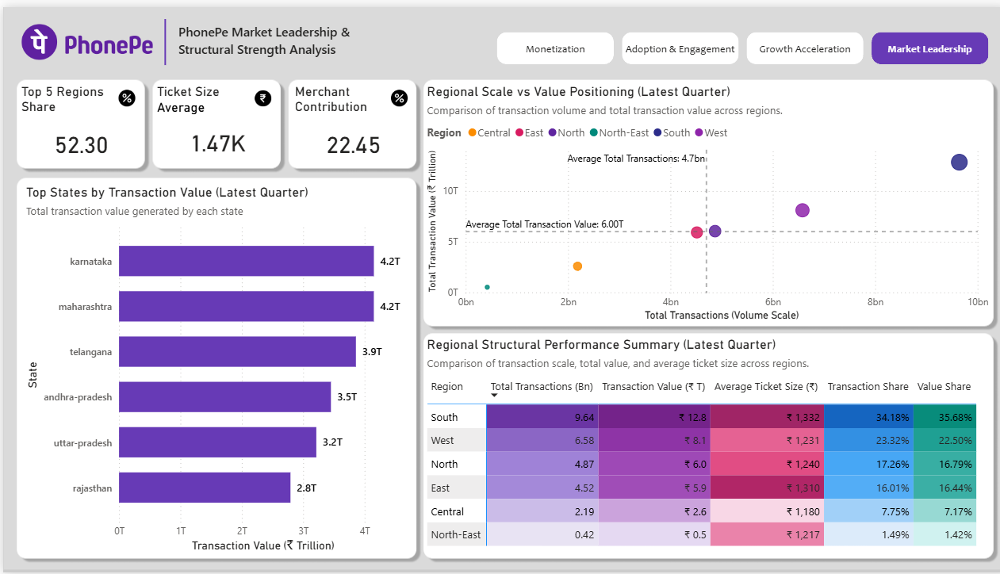

# PhonePe_Pulse_Fintech_Analytics
### Adoption, Monetization & Structural Performance Study (2018–2024)

This project analyzes India’s digital payment ecosystem using PhonePe Pulse open data.  
The objective is to study platform growth, monetization structure, user engagement depth, and regional performance using a structured SQL-driven analytical framework.

The analysis is built using a warehouse-first approach where all KPIs and growth calculations are defined in SQL and visualized through Power BI.

---

## 📈 Latest Quarter Snapshot (Q4 2024)

- ₹36 Trillion – Total Transaction Value  
- 28.22 Billion – Total Transactions  
- 9.29% – QoQ Transaction Growth  
- 586.76 Million – Registered Users  
- 22.45% – Merchant Share  
- 52.30% – Transaction Value Concentration (Top 5 States)

---

## 🧠 Key Analytical Observations

#### 1️⃣ Structural Leadership

The South region contributes **34.18% of total transaction volume** and **35.68% of total transaction value**, indicating a structurally dominant role in the national digital payments ecosystem.

#### 2️⃣ Market Concentration Pattern

The top 5 states account for **52.30% of total transaction value**, suggesting moderate concentration rather than evenly distributed adoption.

#### 3️⃣ Monetization Structure

Merchant share has reached **22.45%**, while P2P transactions remain at **73.99%**. This reflects gradual monetization progression while maintaining strong peer-to-peer dominance.

#### 4️⃣ Engagement Maturity

With **586.76 million registered users**, user acquisition remains strong. However, engagement growth shows stabilization trends, indicating a shift toward platform maturity.

#### 5️⃣ Regional Efficiency Insight

Regions with smaller transaction volumes maintain comparable average ticket sizes, suggesting monetization opportunity is not purely dependent on scale.

---

## 🏗 Data & Modeling Approach

- Data extracted from PhonePe Pulse open GitHub repository  
- JSON ingestion and transformation performed using Python  
- Structured warehouse designed in MySQL  
- Growth metrics implemented using window functions (LAG)  
- Analytical views created before BI layer  
- Power BI used strictly for visualization and structured reporting  

All percentage growth and share metrics are calculated carefully to avoid aggregation bias.

---

## 🛠 Tools & Technologies

#### 🐍 Python
- Extracted data programmatically from PhonePe Pulse GitHub repository (API-style ingestion) 
- Parsed and flattened JSON files  
- Cleaned and structured datasets for analysis  

#### 🗄 MySQL
- Designed fact and dimension tables  
- Built analytical views for adoption, monetization, and growth  
- Used window functions (LAG) for QoQ and YoY calculations  

#### 📊 Power BI
- Created structured dashboards across multiple themes  
- Built semantic model with controlled relationships  
- Implemented share % and weighted engagement ratios  

#### 📐 DAX
- Used for percentage share calculations  
- Created weighted measures (e.g., Engagement Ratio)  
- Avoided business growth logic inside BI layer  
 
---

## 📊 Dashboard Structure

1. **Monetization Mechanics**  
   Merchant mix, regional merchant intensity, value contribution.

2. **User Adoption & Engagement**  
   User growth trends, engagement ratio, regional engagement comparison.

3. **Platform Expansion & Acceleration**  
   QoQ & YoY regional transaction growth analysis.

4. **Market Leadership & Structural Strength**  
   Regional dominance, concentration analysis, ticket size behavior.

---

## Dashboard Preview

### Monetization Mechanics

### Market Leadership & Structural Strength

---

📄**Full Dashboard (All Pages – PDF):**  
🔹[View Complete Dashboard PDF](07_Dashboard/Dashboard.pdf)

This PDF contains **all dashboard pages across Market & Sales, Delivery & Operations, Retail Store, and Customer analysis**.

---

## Project Documentation

- 📄 [Project Overview](05_Documentation/01_Project_Overview.docx)

- 📄 [Data Source & Methodology](05_Documentation/02_Data_Methodology.docx)

- 📄 [Warehouse Architecture](05_Documentation/03_Data_Model_Architecture.docx)

- 📄 [Dashboard Design Framework](05_Documentation/04_Dashboard_Framework.docx)

- 📄 [KPI Definitions & Governance](05_Documentation/05_KPI_Governance_Framework.docx)

- 📄 [Insights Interpretation](06_Insights/05_Insights.docx)
  
---

## 🎯 What This Project Demonstrates

- SQL-based analytical modeling  
- Window function implementation for growth analysis  
- Structured KPI governance  
- Regional monetization evaluation  
- Engagement analytics  
- Clean and disciplined BI modeling  

This project reflects my approach to building structured, governance-focused analytics rather than surface-level dashboard reporting.
