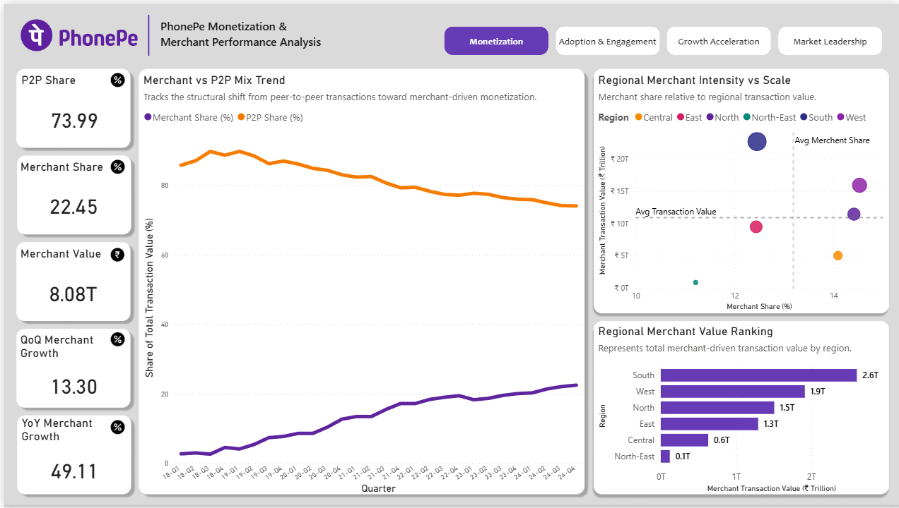
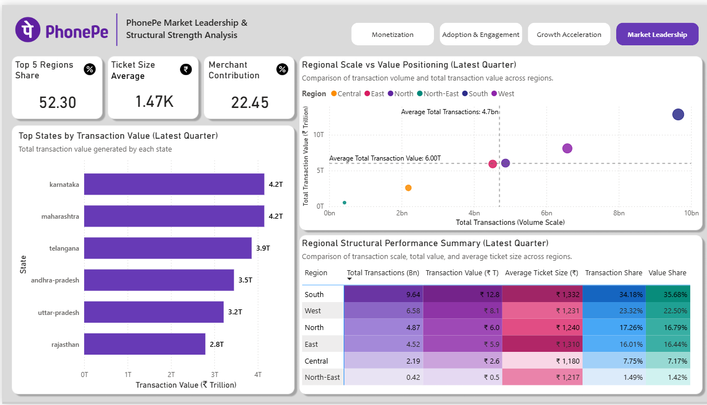

# PhonePe Pulse — India Digital Payments Analytics

**Python** · **MySQL** · **Power BI** · **DAX**


## The Problem

India's UPI ecosystem generates massive transaction data across states, user segments, and payment categories. PhonePe Pulse makes this data public — but raw JSON exports across hundreds of district-level files don't tell you much on their own.

The questions worth asking: Where is monetization actually happening? Which regions are driving structural growth versus one-time spikes? And is the platform maturing or still in aggressive acquisition mode?

> Is India's digital payment growth broad-based, or structurally concentrated in a few states — and what does that mean for monetization?

---

## What I Built

An end-to-end analytics pipeline that ingests PhonePe Pulse JSON data from GitHub, transforms it through a MySQL warehouse, and surfaces adoption, monetization, and regional performance metrics across four Power BI dashboard pages. All business logic — growth rates, share calculations, engagement ratios — lives in SQL views and DAX measures, keeping the BI layer strictly for visualization.

---

## Tech Stack

| Layer | Tool | Purpose |
|---|---|---|
| Ingestion & ETL | Python | API-style GitHub pull, JSON flattening, data cleaning |
| Warehouse & Analytics | MySQL | Fact/dimension modeling, window functions, analytical views |
| Visualization | Power BI + DAX | Dashboard layer, share % measures, engagement ratios |

---

## Dashboard Pages

### 1. Monetization Mechanics
Merchant mix, regional merchant intensity, P2P vs. merchant value split.



### 2. Market Leadership & Structural Strength
Regional dominance, concentration analysis, ticket size behavior by geography.



> 📄 [Full Dashboard PDF — all four pages](07_Dashboard/Dashboard.pdf)

---

## Key Findings

- **The South region accounts for 34.18% of transaction volume and 35.68% of value — structurally dominant, not just large**
- Top 5 states hold 52.3% of total transaction value — moderate concentration, not winner-takes-all
- Merchant share sits at 22.45% against 73.99% P2P — monetization is progressing but P2P dominance is intact
- 586.76M registered users with stabilizing engagement growth — classic platform maturity signal
- Smaller-volume regions maintain comparable average ticket sizes — monetization opportunity exists beyond scale

---

## Recommendations

- **Merchant acquisition priority:** Regions with high P2P volume but low merchant share are undermonetized — addressable with targeted onboarding
- **Engagement over acquisition:** With user growth stabilizing, retention and transaction frequency should be the primary metric focus
- **Tier-2/3 expansion:** Comparable ticket sizes in lower-volume regions suggest structural readiness, not just latent demand

---

## Data Model

Warehouse-first design in MySQL. Growth metrics computed using `LAG()` window functions before the BI layer, preventing aggregation errors in Power BI.

```
Staging  →  Dimensions  →  Facts  →  Analytical Views  →  Power BI

03_SQL/01_staging        Database setup, raw data load
03_SQL/02_dimensions     dim_time, dim_state
03_SQL/03_facts          fact_transactions, fact_users, fact_insurance
03_SQL/04_analytical_views
  ├── A_ prefix          Adoption (national + regional growth)
  ├── I_ prefix          Insurance growth and mix
  ├── M_ prefix          Monetization (merchant vs P2P)
  ├── U_ prefix          User growth and engagement
  ├── V_ prefix          Quarterly volume breakdowns
  └── Z_ prefix          Master KPI summary (consolidated view for BI)
```

---

## Repo Structure

```
PhonePe_Pulse_Fintech_Analytics/
│
├── 01_Data/                    # Raw JSON from PhonePe Pulse GitHub
├── 02_Notebooks/               # Python ingestion and transformation notebooks
├── 03_SQL/                     # Schema DDL, analytical views, queries
├── 04_PowerBi/                 # .pbix file and semantic model config
├── 05_Documentation/           # Project overview, methodology, architecture docs
├── 06_Insights/                # Written interpretation of findings
└── 07_Dashboard/               # Dashboard screenshots
    
```

---

## Documentation

| Document | Description |
|---|---|
| [Project Overview](05_Documentation/01_Project_Overview.docx) | Scope, objectives, analytical approach |
| [Data Source & Methodology](05_Documentation/02_Data_Methodology.docx) | PhonePe Pulse structure, ingestion logic |
| [Warehouse Architecture](05_Documentation/03_Data_Model_Architecture.docx) | Schema design, view definitions |
| [Dashboard Design Framework](05_Documentation/04_Dashboard_Framework.docx) | Page structure, measure governance |
| [KPI Definitions](05_Documentation/05_KPI_Governance_Framework.docx) | Metric definitions, calculation rules |
| [Insights Interpretation](06_Insights/05_Insights.docx) | Full analytical narrative |

---

*Built to demonstrate warehouse-first analytics — business logic in SQL, not in the BI tool.*

---
